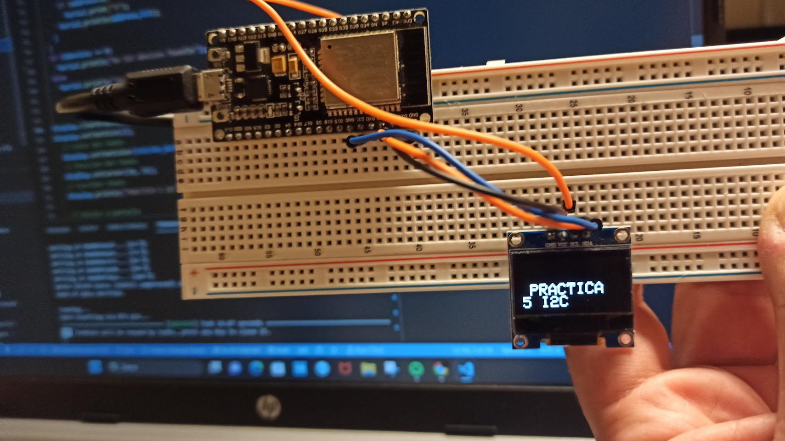

## practica 5B

Ahora Conectaremos una pantalle LCD a traves del Bus I2C y mostraremos un texto por pantalla.

**CODIGO**

```cpp
#include <Arduino.h>
#include <Wire.h>
#include <Adafruit_GFX.h>
#include <Adafruit_SSD1306.h>

#define ancho 128
#define alto 64

Adafruit_SSD1306 display (ancho, alto, &Wire, -1);

void setup()
{
  Wire.begin();
 
  Serial.begin(115200);
  while (!Serial); 
  Serial.println("\nI2C Scanner");

  display.begin(SSD1306_SWITCHCAPVCC, 0x3C);
}
 
 
void loop()
{
  byte error, address;
  int nDevices;
 
  Serial.println("Scanning...");
 
  nDevices = 0;
  for(address = 1; address < 127; address++ )
  {
    // The i2c_scanner uses the return value of
    // the Write.endTransmisstion to see if
    // a device did acknowledge to the address.
    Wire.beginTransmission(address);
    error = Wire.endTransmission();
 
    if (error == 0)
    {
      Serial.print("I2C device found at address 0x");
      if (address<16)
        Serial.print("0");
      Serial.print(address,HEX);
      Serial.println("  !");
 
      nDevices++;
    }
    else if (error==4)
    {
      Serial.print("Unknown error at address 0x");
      if (address<16)
        Serial.print("0");
      Serial.println(address,HEX);
    }    
  }
  if (nDevices == 0)
    Serial.println("No I2C devices found\n");
  else
    Serial.println("done\n");
 
  delay(5000); // wait 5 seconds for next scan

display.clearDisplay();
display.setTextSize(1);
  // Color del texto
  display.setTextColor(SSD1306_WHITE);
  // Posición del texto
  display.setCursor(10, 32);
  // Escribir texto
  display.println("PRACTICA 5 I2C");
 
  // Enviar a pantalla
  display.display();
}
```


**Librerias**

```cpp
#include <Arduino.h>
#include <Wire.h>
#include <Adafruit_GFX.h>
#include <Adafruit_SSD1306.h>
```
Para poder utilizar la pantalla de adafruit tenemos que añadir las librerias que nos proporciona la propia marca a de mas de las ya vistas previamente en la practica 5

**Declaraciones**
```cpp
#define ancho 128
#define alto 64

Adafruit_SSD1306 display (ancho, alto, &Wire, -1);
```
En este apartado declaramos el tamaño de la pantalla en pixeles y ademas declaramos el objeto Adafruit_ssd1303 que sera la pantalla lcd.

**Setup**
```cpp
void setup()
{
  Wire.begin();
 
  Serial.begin(115200);
  while (!Serial); 
  Serial.println("\nI2C Scanner");

  display.begin(SSD1306_SWITCHCAPVCC, 0x3C);
}
 
 ```
 
 En el setup iniciamos el bus i2c el serial y finalmente el deisplay añadido recientemente.

 **LOOP**

```cpp
void loop()
{
  byte error, address;
  int nDevices;
 
  Serial.println("Scanning...");
 
  nDevices = 0;
  for(address = 1; address < 127; address++ )
  {
    // The i2c_scanner uses the return value of
    // the Write.endTransmisstion to see if
    // a device did acknowledge to the address.
    Wire.beginTransmission(address);
    error = Wire.endTransmission();
 
    if (error == 0)
    {
      Serial.print("I2C device found at address 0x");
      if (address<16)
        Serial.print("0");
      Serial.print(address,HEX);
      Serial.println("  !");
 
      nDevices++;
    }
    else if (error==4)
    {
      Serial.print("Unknown error at address 0x");
      if (address<16)
        Serial.print("0");
      Serial.println(address,HEX);
    }    
  }
  if (nDevices == 0)
    Serial.println("No I2C devices found\n");
  else
    Serial.println("done\n");
 
  delay(5000); // wait 5 seconds for next scan

display.clearDisplay();
display.setTextSize(1);
  // Color del texto
  display.setTextColor(SSD1306_WHITE);
  // Posición del texto
  display.setCursor(10, 32);
  // Escribir texto
  display.println("PRACTICA 5 I2C");
 
  // Enviar a pantalla
  display.display();}
  
```

EL void loop es igual que en el apartado practica 5b para comprobar los dispositivos i2c conectados con el añadido que ahora tenemos unas lineas de codigo dedicadas a la pantalla lcd funcionando igual que funcionaria un Serial monitor:

Primero de todo hacemos un clear para borrar todo lo que se mostraba anteriormente en la pantalla y establecemos el tamaño del texto.
Despues escogemos un color y centramos el texto con el comnando setCursor.
Escribimos con un println el texto que enviaremos a la pantalla y finalmente lo enviamos con el comnado display().





